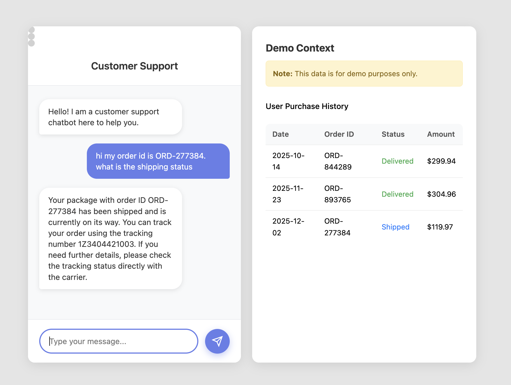
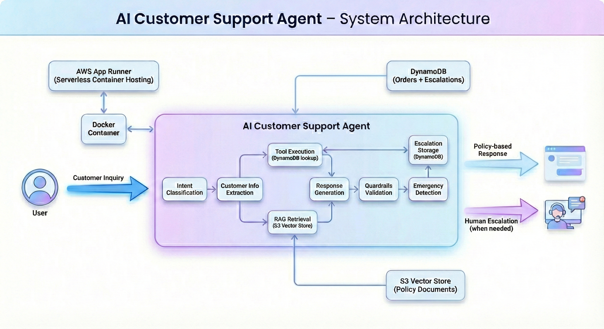
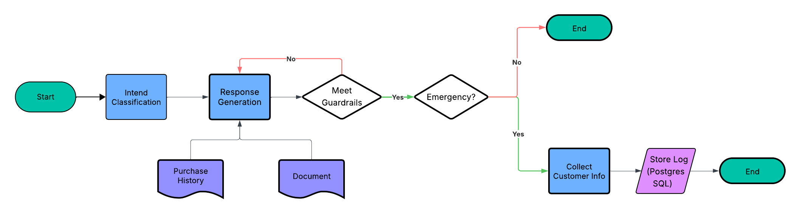
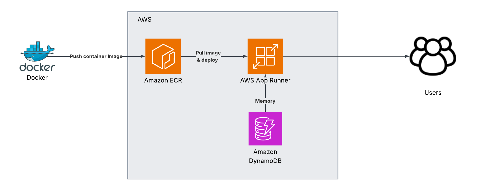

# Customer Support Agent

An AI-powered customer support agent that handles customer questions wit policy-based responses and intelligent escalation.

**Deployed on AWS App Runner**: Serverless container hosting with automatic scaling

> The screenshot above shows a demo conversation with the AI agent. For demo purpose, added some purchase history mock data. 
> The live demo is hosted on AWS App Runner. To manage costs, the deployment may occasionally be paused.  
> If the live chat demo link is not working, feel free to reach out and I'll be happy to provide access the demo!

Read more technical details: [/src/README.md](./src/README.md).
## What It Does

The chatbot provides quick, accurate responses to customer questions about following categories:

- **Billing & Payment** - Charges, invoices, payment methods, pricing questions  
- **Subscription** - Starting, canceling, upgrading, or modifying subscriptions  
- **Account Issues** - Login problems, password resets, profile updates  
- **Shipping & Delivery** - Tracking information, delivery status, shipping updates  
- **Returns & Refunds** - Return processes, refund requests, damaged items  
- **General Inquiries** - Other customer service questions  

## Workflow Architecture
The agent follows this workflow for each customer inquiry:

### Key Components

1. **Intent Classification** - Categorizes inquiries 
2. **Customer Info Extraction** - Extracts email, name, order IDs from conversation 
3. **Tool Execution** - Queries DynamoDB purchase history table for order details
4. **RAG Retrieval** - Retrieves relevant policy documents from S3 Vectors using semantic search
5. **Response Generation** - Generates response using retrieved context, tool results, and conversation history
6. **Guardrails Validation** 
7. **Emergency Detection**  
8. **Escalation Storage** - Stores escalation records in DynamoDB for human agent review

## Deployment

**Infrastructure**: AWS App Runner
- **Container**: Docker image 
- **Database**: DynamoDB 
- **Vector Store**: S3 Vectors (policy documents for RAG)

See [/infra/README.md](./infra/README.md) for deployment instructions.

