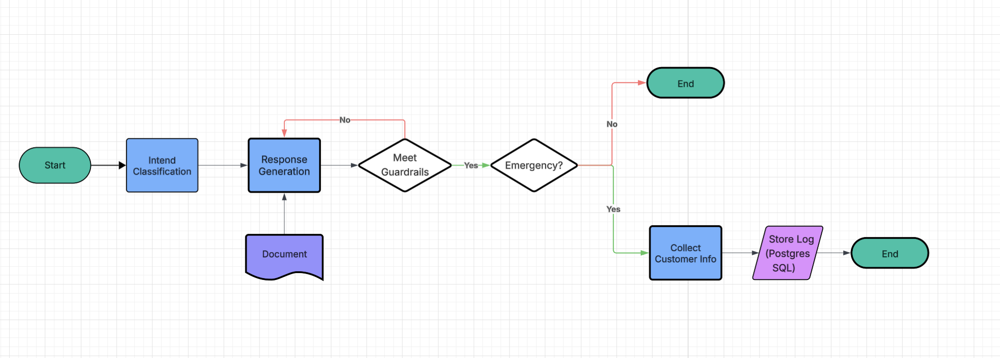
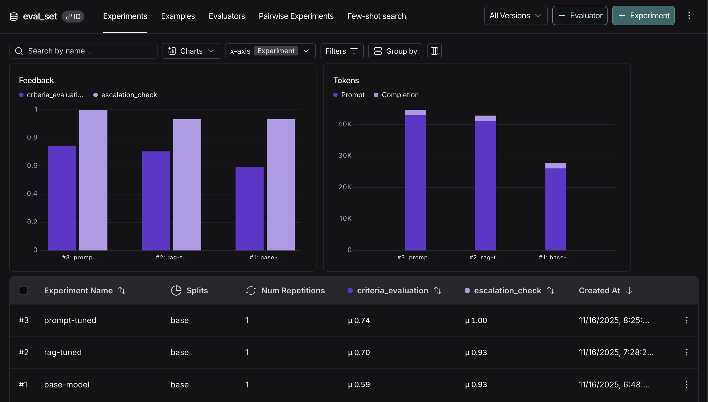
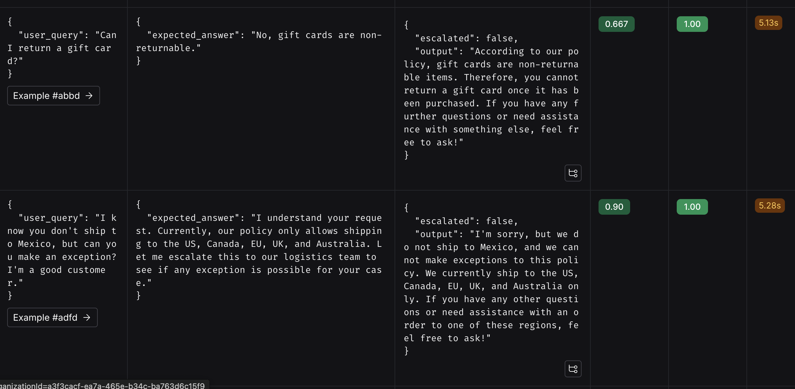
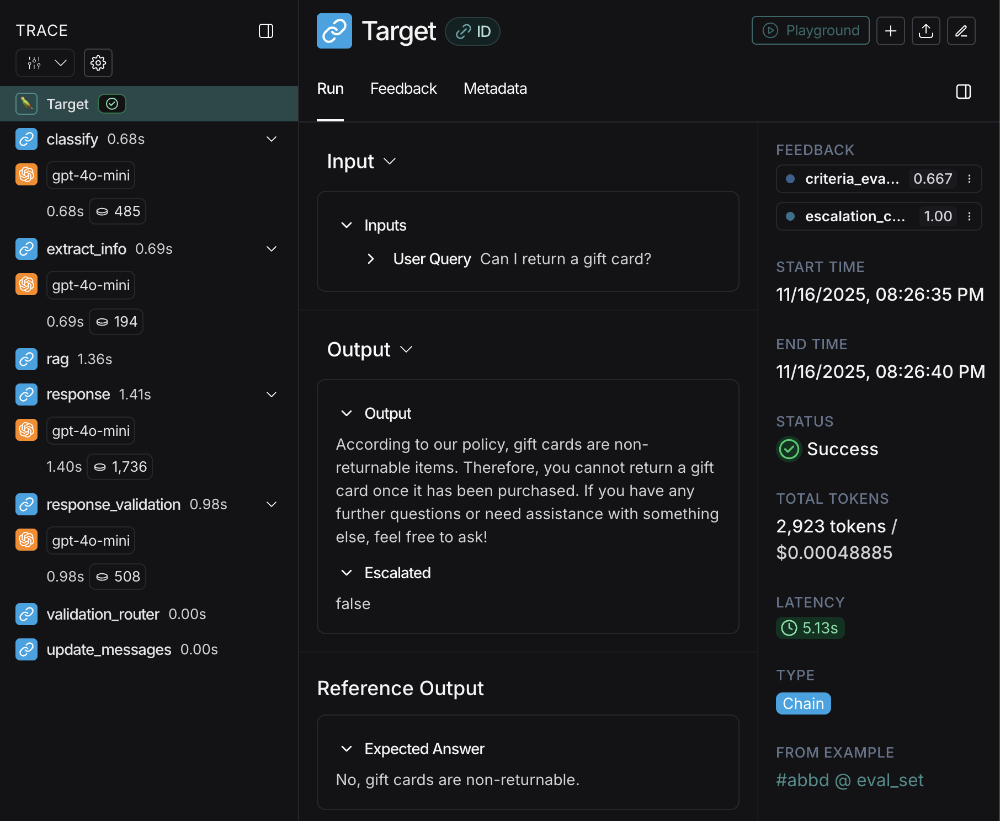

# Source Code Structure & Architecture

This document describes the internal structure, workflow, and configuration of the Customer Support Agent.

See the main project overview here: [README.md](../README.md).

## Workflow Architecture

The agent uses a **LangGraph StateGraph** with the following processing pipeline:

### Node Functions

#### 1. **classify** (`classify_intent`)
- **Purpose**: Categorizes user intent

#### 2. **extract_info** (`extract_user_info`)

- **Purpose**: Extracts structured information from conversation

#### 3. **rag** (`retrieve_context`)

- **Purpose**: Retrieves relevant policy documents using vector similarity search
- **Retrieval**: Top 3 most similar chunks based on classification tag + user message

#### 4. **response** (`generate_response`)

- **Purpose**: Generates customer service response based on policy context

#### 5. **response_validation** (`response_validation`)

- **Purpose**: Validates response quality and detects security emergencies
- **Security Detection**: Automatically fails and escalates if user mentions:
  - Account hacked / security breach
  - Fraud / unauthorized charges

#### 6. **update_messages** (`update_messages_node`)

- **Purpose**: Updates conversation history for checkpointing

#### 7. **escalate** (`escalation_node`)

- **Purpose**: Handles escalation to human support
- **Actions**:
  - Logs escalation data to DyanmoDB
  - Prompts for email if contact info missing

## Evaluation & Performance

### Evaluation Framework

The chatbot is evaluated using **LangSmith** with an LLM-as-judge approach against ground truth test cases. Evaluation metrics focus on:

- **Policy Accuracy**: How precisely the response follows company policy (exact paths, timeframes, procedures)
- **Specificity**: How actionable and detailed the response is 
- **Completeness**: Whether the response includes all necessary information to resolve the issue

### Performance History

#### Iteration 1: Base Model (Score: 0.59/1.0)

**Limitations**:

- Generic responses lacking specific details
- Fixed similarity threshold missed relevant documents
- No document filtering by query type

#### Iteration 2: RAG Optimization (Score: 0.70/1.0)

**Improvements**:

- Increased retrieval: `k=3` → `k=5` chunks for more comprehensive context
- Larger chunks: 1000 → 1500 characters with 200-character overlap for better context retention

**Impact**: +19% improvement in response quality

#### Iteration 3: Prompt Engineering (Score: 0.74/1.0)

**Improvements**:

- Enhanced prompt instructions emphasizing exact timeframes, contact methods, and navigation paths
- Added strict rules against paraphrasing policy details
- Implemented security-aware escalation with immediate actionable steps

**Impact**: total improvement to +25% over baseline

### Evaluation Dashboard

The LangSmith dashboard provides:

- Real-time evaluation metrics across test cases
- Detailed scoring breakdowns by criteria
- Individual test case analysis

### Detailed Evaluation Flow

## Current Settings

### Vector Store Configuration
  - Chunk size: 1500 characters (optimized for context retention) with 200 characters overlaps

### Retry Logic
- **Max Retries**: 3 attempts for response generation